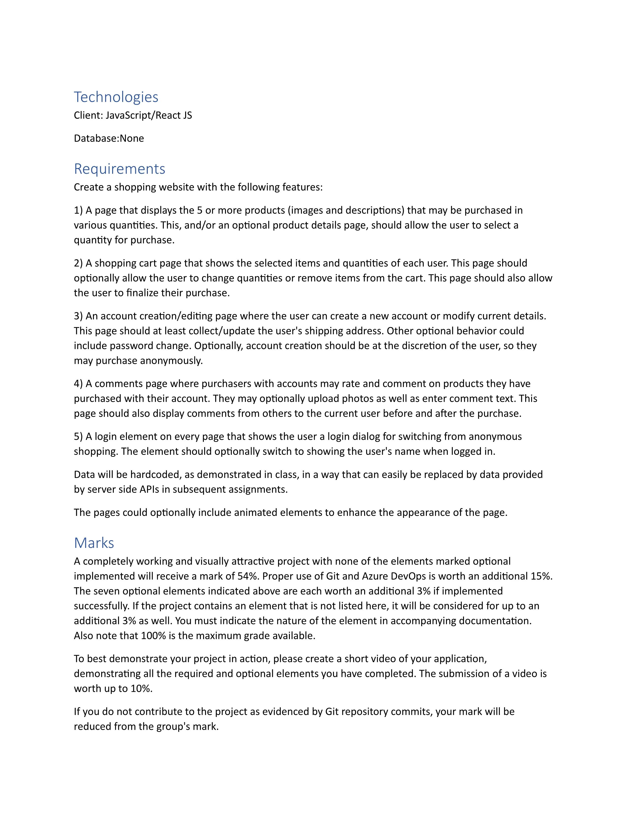
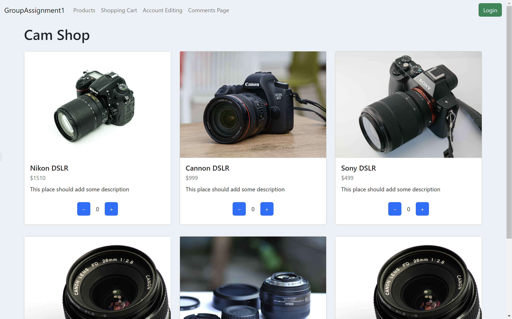
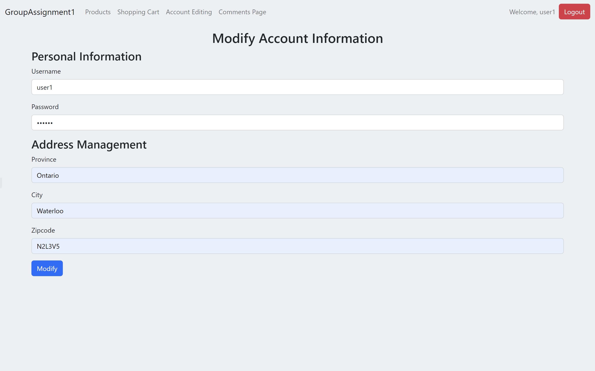
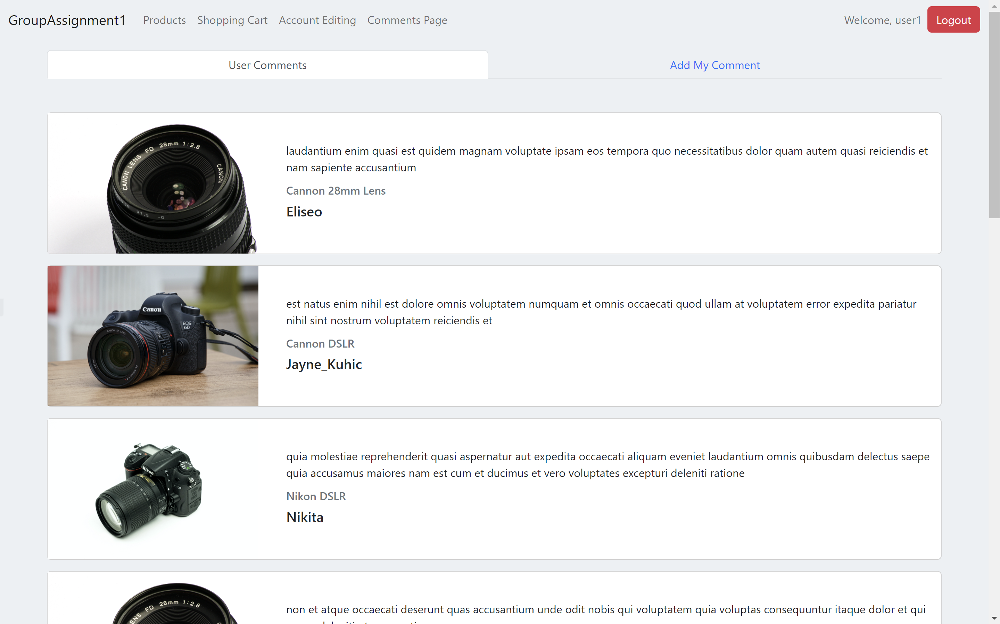

# PROG8185-23S-Sec1-Web-Technologies-Assignment1-React-Store-App

The Assignment 1 of Web Technologies require a group with 4 to 5 members to create a web application by React. The data of the application should be store locally (eg. the data is storing in the localStorage). This project is developed by Siyu Liu, Eugenio Contreras Lizana, Asad Ullah Ashraf and Akshat Arora.

## Requirements

## Preview

